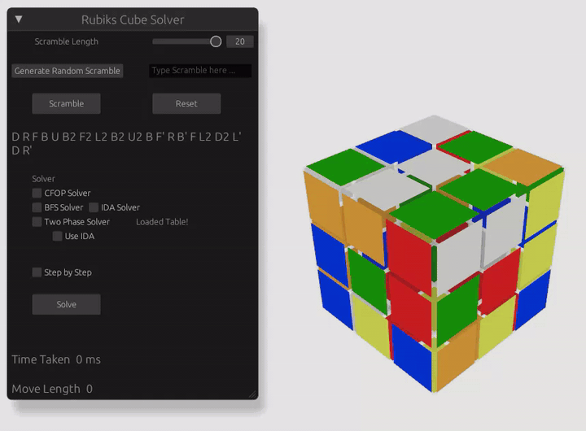

# Rubik's Cube Solver

A Rust scientific-computing project for representing, scrambling, visualizing, and solving a 3x3 Rubik's Cube. The project combines an interactive Bevy UI with several solver strategies, including CFOP, breadth-first search, IDA*, and a two-phase solver backed by precomputed move and pruning tables.

<p align="center">
  
</p>

## Features

- Interactive 3D cube visualization built with Bevy and egui.
- Random scramble generation and manual Singmaster-notation input.
- Solver selection from CFOP, BFS, IDA*, and two-phase search.
- Optional step-by-step solution playback with previous/next controls.
- Runtime display for solve time and solution move count.
- Experimental data files and plotting scripts for solver-performance analysis.

## Quick Start

Install a stable Rust toolchain, then run the application from the project root:

```bash
git clone https://github.com/Michal2404/SciComp-project.git
cd SciComp-project
cargo run
```

The application opens a native window. At startup the two-phase solver tables are loaded in the background; the UI shows `Loading Table ...` until they are ready.

## Using the UI

1. Choose a scramble length, then generate a random scramble or type one manually.
2. Press `Scramble` to apply the sequence to the cube.
3. Select exactly one solver.
4. Press `Solve` to compute and animate the solution.
5. Enable `Step by Step` before solving if you want to play the solution one move at a time.

Supported move notation follows standard face turns such as `R`, `U'`, and `F2`.

## Solver Notes

- `CFOP Solver` applies the Cross, F2L, OLL, and PLL stages.
- `BFS Solver` searches breadth-first and is intended only for short scrambles.
- `IDA Solver` uses iterative deepening A* with a depth limit.
- `Two Phase Solver` uses the two-phase coordinate representation and pruning tables. The optional `Use IDA` setting tries a bounded IDA* search before falling back to the two-phase search.

## Project Layout

| Path | Purpose |
| --- | --- |
| `src/main.rs` | Application entry point. |
| `src/ui/` | Bevy scene, camera controls, cube animation, and egui interface. |
| `src/rubiks/` | Basic facelet-style cube model and move application. |
| `src/cfop/` | CFOP solver stages and algorithm tables. |
| `src/rubiks_two_phase/` | Cubie/coordinate representation, pruning tables, BFS, IDA*, and two-phase solver. |
| `src/data/` | Solver benchmark data. |
| `src/plots/` | Generated performance plots. |
| `tests/` | Integration tests. |
| `literature/` | Reference papers used during development. |
| `assets/` | README media generated from `video.webm`. |

## Testing

Run the Rust test suite with:

```bash
cargo test
```

## Plotting

The repository includes `plotter.py` for regenerating analysis figures from the data files in `src/data/`.

```bash
python3 -m pip install pandas matplotlib seaborn openpyxl
python3 plotter.py
```

## License

No license file is currently included in this repository.
assets/
