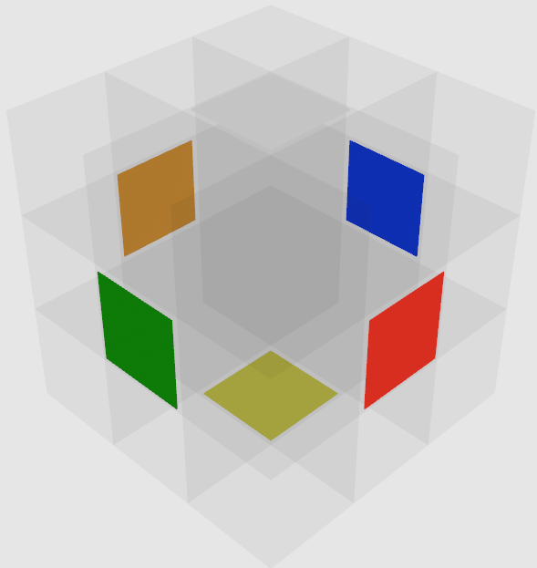
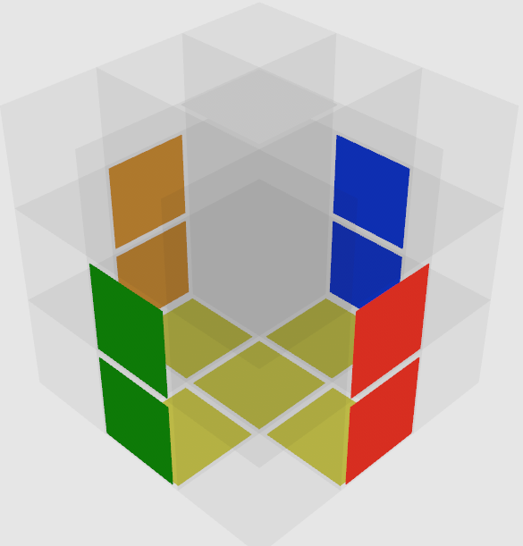
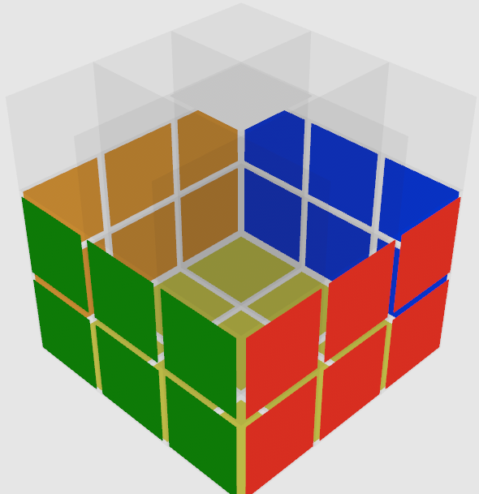
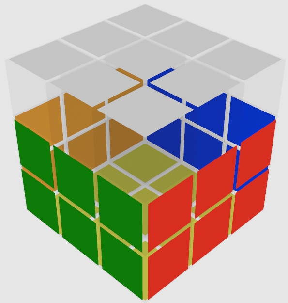
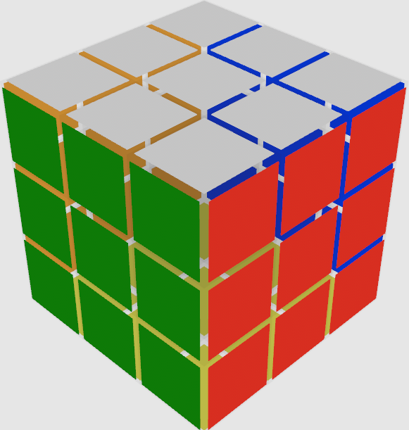
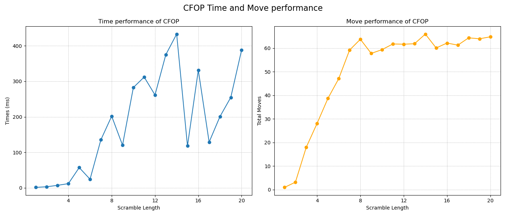
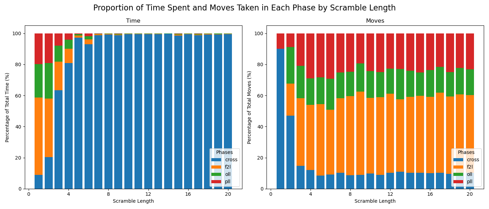
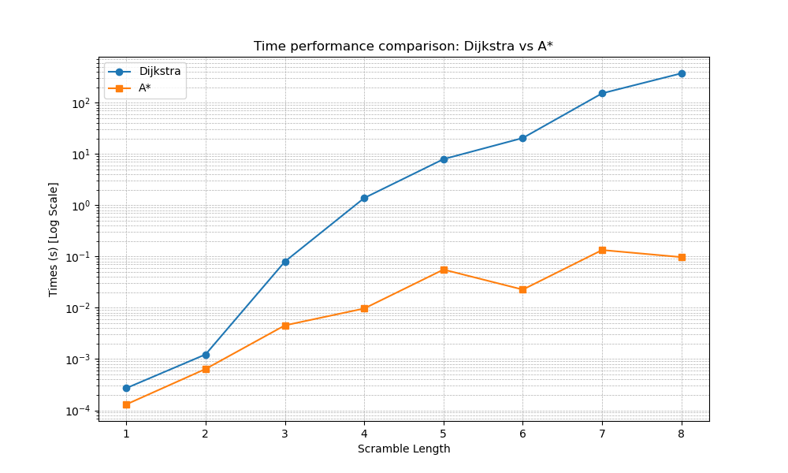

# SciComp Project - Rubik's Cube Solvers

Interactive Rubik's Cube visualization and solver playground built in Rust (Bevy + egui), with multiple solver strategies and performance-analysis artifacts.

## Features
- 3D interactive cube UI (`cargo run`)
- Solver options in-app:
  - `CFOP` (Cross -> F2L -> OLL -> PLL)
  - `BFS` (depth-limited search)
  - `IDA*`
  - `Two-Phase` solver (with optional IDA* pre-search)
- Step-by-step replay (`Previous` / `Next`) or full automatic playback
- Timing + move-count display in UI
- Analysis assets:
  - spreadsheets in `src/data/`
  - plotting script `plotter.py`
  - presentation media in `presentation/`

CFOP algorithm tables currently include:
- `src/cfop/f2l_algorithm.txt`: 164 entries
- `src/cfop/oll_algorithm.txt`: 57 entries
- `src/cfop/pll_algorithm.txt`: 21 entries

## Quick Start
### Requirements
- Rust toolchain (stable)
- A machine/environment that can open a Bevy graphics window

### Clone
```bash
git clone https://github.com/Michal2404/SciComp-project.git
cd SciComp-project
```

### Run
```bash
cargo run
```

### Basic UI flow
1. Generate or type a scramble (e.g. `R U R' U' F2`)
2. Click `Scramble`
3. Select one solver
4. Click `Solve`
5. Optionally enable `Step by Step` and use `Previous` / `Next`

### Controls
- Mouse wheel: zoom camera
- Left-mouse drag: rotate camera
- Arrow keys: pan camera

## Testing
Run:
```bash
cargo test
```

Current repository status: `16 passed`, `2 failed` (`rubiks_two_phase::cubie::tests::test_corners`, `rubiks_two_phase::cubie::tests::test_slice_sorted`).

## Project Layout
- `src/ui/` - Bevy scene, camera, UI, animations
- `src/cfop/` - CFOP implementation + algorithm files
- `src/rubiks_two_phase/` - two-phase representation/search/pruning
- `src/rubiks/` - sticker-level cube representation + move application
- `src/data/`, `src/plots/` - experiment datasets and generated figures
- `presentation/` - screenshots, charts, and demo videos
- `literature/` - background papers
- `tests/` - integration tests

## Screenshots (from `presentation/`)
### Solving Pipeline
| Scramble | Cross |
| --- | --- |
|  |  |

| F2L | OLL |
| --- | --- |
|  |  |

| PLL |
| --- |
|  |

### Performance Visuals
| CFOP Time and Moves | CFOP Phase Time Share |
| --- | --- |
|  |  |

| Dijkstra vs A* |
| --- |
|  |

## Demo Videos
- Notation demos: [U](presentation/U_notation.mp4), [D](presentation/D_notation.mp4), [L](presentation/L_notation.mp4), [R](presentation/R_notation.mp4), [F](presentation/F_notation.mp4), [B](presentation/B_notation.mp4)
- CFOP phases: [cross](presentation/cross_solve.mp4), [f2l](presentation/f2l_solve.mp4), [oll](presentation/oll_solve.mp4), [pll](presentation/pll_solve.mp4)
- Search demo: [search_stuff.mp4](presentation/search_stuff.mp4)
